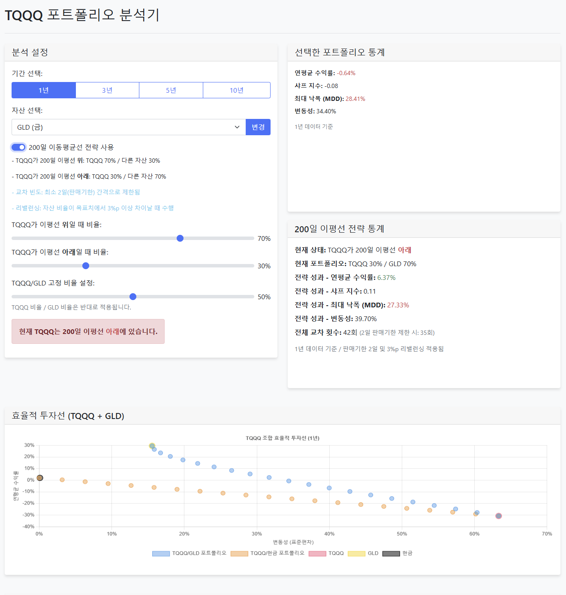
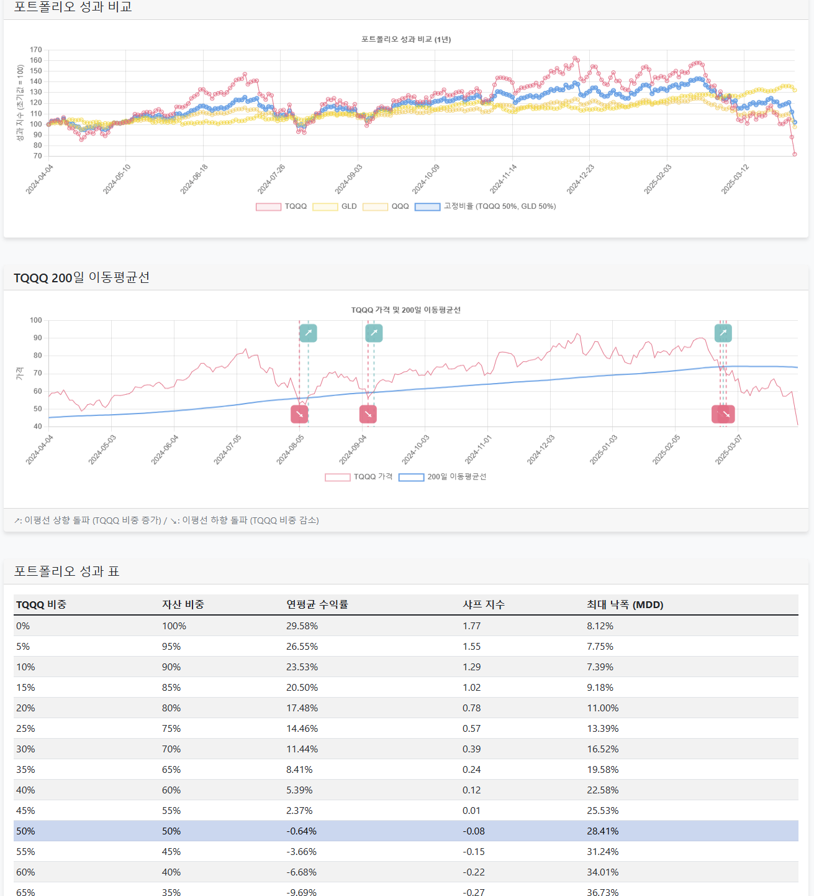

# TQQQ 포트폴리오 분석 시뮬레이션

이 웹 애플리케이션은 TQQQ와 다양한 자산을 조합한 포트폴리오의 성과를 분석하고 시뮬레이션하는 도구입니다. 특히 200일 이동평균선을 활용한 전략적 자산 배분 효과를 확인할 수 있습니다.




## 주요 기능

### 1. 효율적 투자선 분석
- TQQQ와 선택 자산(GLD, SHY, TLT, SCHD, VNQ)의 효율적 투자선 시각화
- TQQQ와 현금 조합의 효율적 투자선과 비교 가능
- 변동성 대비 수익률 관점에서 최적 자산 배분 분석

### 2. 200일 이동평균선 전략
- TQQQ가 200일 이동평균선 위/아래에 있을 때 다른 자산 배분 비율 적용
- 이평선 위: TQQQ 60%, 다른 자산 40% (기본값, 조정 가능)
- 이평선 아래: TQQQ 20%, 다른 자산 80% (기본값, 조정 가능)
- 주 1회 제한: 교차 빈도를 최소 7일(1주일) 간격으로 제한하여 과도한 거래 방지

### 3. 성과 비교 및 통계
- 선택한 포트폴리오의 연평균 수익률, 샤프 지수, 최대 낙폭(MDD), 변동성 확인
- 다양한 자산 비율 조합에 따른 성과 비교 표
- 1년, 3년, 5년, 10년 등 다양한 기간 선택 가능

### 4. 실시간 이동평균선 차트
- TQQQ 가격과 200일 이동평균선 시각화
- 이평선 교차점 표시
- 현재 TQQQ가 이평선 위/아래 위치 상태 확인

## 활용 예시

1. **자산 선택**: TQQQ와 함께 투자할 자산(GLD, SHY, TLT, SCHD, VNQ)을 선택합니다.
2. **기간 설정**: 1년, 3년, 5년, 10년 중 분석 기간을 선택합니다.
3. **분산투자 전략**: TQQQ와 선택 자산의 투자 비율을 조정하여 최적의 포트폴리오를 구성합니다.
4. **이평선 전략 활용**: 200일 이동평균선 전략을 사용하여 시장 상황에 따라 자동으로 자산 배분을 조정합니다.

## 기술 스택

- **프론트엔드**: HTML, CSS, JavaScript, Bootstrap, Chart.js
- **백엔드**: Node.js, Express
- **데이터 소스**: Yahoo Finance API (실제 주식 데이터 기반)

## 시작하기

1. 저장소 클론
```bash
git clone https://github.com/lee-daon/tqqq-.git
cd tqqq-
```

2. 의존성 설치
```bash
npm install
```

3. 서버 실행
```bash
npm start
```

4. 브라우저에서 애플리케이션 접속
```
http://localhost:3000
```
